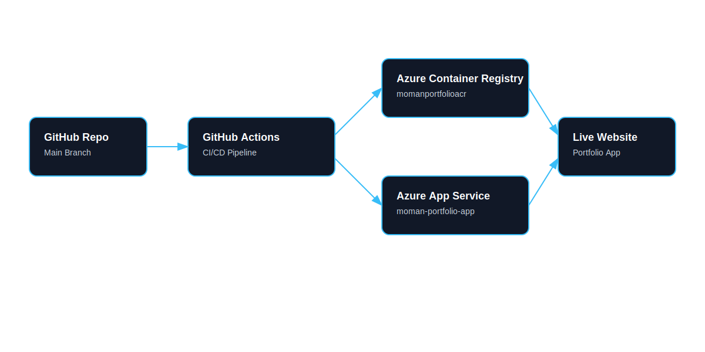

# Moman | DevOps Portfolio

Live Website: [Visit the portfolio](https://moman-portfolio-app-a4hueuatd3d8e5f2.ukwest-01.azurewebsites.net)

I built this project as a static portfolio that also demonstrates a real DevOps workflow.

The website itself is intentionally simple. What I wanted to show was the engineering around it:
Docker, GitHub Actions, build metadata, environment variables, and a deployment flow that could be
connected to Azure App Service.

## Project Overview

This started as a normal personal portfolio and gradually turned into a DevOps learning project.
I built it because I wanted hands-on experience with the theory I had been learning around:

- containers
- CI/CD
- build metadata
- cloud deployment
- environment-driven configuration

The pages stay lightweight and easy to read, but the delivery process now tells a much bigger story.

## Architecture Overview



## Architecture Summary

- Containerised static portfolio
- CI/CD with GitHub Actions
- Docker-based build pipeline
- Deployment to Azure App Service
- Image storage in Azure Container Registry

## My Profiles

- GitHub: [github.com/MohammadMoman](https://github.com/MohammadMoman)
- LinkedIn: [linkedin.com/in/moman-mohammad-25748540b](https://www.linkedin.com/in/moman-mohammad-25748540b/)

## Pages

- `index.html` - Home, projects, learning log, and contact sections
- `status.html` - Static health page for CI, build, and release demos

## Repository Structure

- `src/components/` - Small reusable UI and layout renderers
- `src/data/` - Static project and learning entries
- `src/pages/` - Page and section composition
- `src/styles/` - Shared visual system
- `src/utils/` - Build metadata helper
- `scripts/` - CI-friendly helper scripts
- `docs/architecture.md` - Simple architecture diagram
- `docs/code-snippets.md` - Explained code snippets from the project
- `docs/deployment.md` - Azure release notes and workflow overview

## Why I Built It

I wanted to move from theory to practice.

I had already learned the concepts around CI/CD, Docker, and cloud deployment, but I wanted to apply
them to a real project instead of only reading about them. This portfolio gave me a safe place to do
that because I could keep the UI simple and focus on the delivery process.

That made the project useful in two ways:

- it became a real portfolio site
- it became a place to practise the DevOps workflow I wanted to learn

## Build Metadata

The site reads build values from `window.__BUILD_INFO__`, which is defined in `src/config/build-info.js`.

The values I expose are:

- `version` - the release or build label
- `buildDate` - when the artifact was created
- `commitHash` - the Git commit the build came from
- `environment` - whether the build is local, development, or production

Those values are generated from environment variables so I can inject the current build context during CI/CD
instead of hardcoding anything into the app.

When I run the build script manually, I set the values like this:

```powershell
$env:APP_VERSION = "v1.0.0"
$env:APP_BUILD_DATE = "2026-06-22T00:00:00Z"
$env:APP_COMMIT_SHA = "a1b2c3d"
$env:APP_ENVIRONMENT = "Production"
node .\scripts\write-build-info.js
```

On GitHub Actions, I pass `github.sha` into `APP_COMMIT_SHA` so the generated metadata points back to the
exact commit that produced the build.

### Build info file

```javascript
window.__BUILD_INFO__ = {
  version: 'v1.0.0',
  buildDate: '2026-06-22T00:00:00Z',
  commitHash: 'a1b2c3d',
  environment: 'Production',
};
```

This file is generated during the build. I kept it separate because it makes the metadata easy to swap
out between local development and CI.

## Docker

I use Docker here for three reasons:

- it makes the static site portable
- it gives me a repeatable build target
- it simulates the kind of packaging step I would use in a real DevOps pipeline

Even though the site is static, putting it in Docker is useful because it mirrors how production
applications are often delivered and it keeps the build process consistent across machines.

### Docker build example

```dockerfile
FROM node:20-alpine

WORKDIR /app

COPY package.json ./
COPY index.html status.html architecture.html ./
COPY Moman.png ./
COPY src ./src
COPY scripts ./scripts

EXPOSE 3000
CMD ["npm", "start"]
```

The Dockerfile is deliberately simple. I wanted it to be easy to follow and easy to explain, especially for
someone reviewing the repository for the first time.

## CI Flow

```text
GitHub push
  ↓
GitHub Actions CI
  ↓
Install dependencies
  ↓
Run lint and tests
  ↓
Build metadata
  ↓
Build Docker image
  ↓
Ready for review
```

This is the main CI story for the project. Every push gets checked, and the pipeline proves the site can
be built in a repeatable way.

### CI workflow example

```yaml
- name: Install dependencies
  run: npm install

- name: Run tests
  run: npm test

- name: Build Docker image
  run: docker build -t portfolio:${{ github.sha }} .
```

These steps are intentionally straightforward. I wanted the workflow to feel like something I actually
wrote while learning, not something over-engineered.

## CD Flow

```text
GitHub push to main
  ↓
GitHub Actions deploy workflow
  ↓
Generate build metadata
  ↓
Build and push Docker image
  ↓
Update Azure App Service
  ↓
Provide ACR credentials to App Service
  ↓
Live website
```

The CD workflow lives in [`.github/workflows/deploy.yml`](./.github/workflows/deploy.yml).
It builds the Docker image, pushes it to my Azure Container Registry, updates the App Service to use the
new image, and makes sure the app service can pull from the private registry with the stored registry
credentials.

## Challenges I Faced

I ran into a few issues while turning a static portfolio into something that looks and behaves more like a
real delivery pipeline.

### 1. The character image did not show up

At one point the page rendered the alt text instead of the fighter image. The issue was not the HTML itself;
the image file was not being copied into the Docker image.

The browser symptom looked like this:

```text
Moman fighter character
```

The fix was to copy `Moman.png` into the image in the `Dockerfile` and to use a reliable relative path in
the hero section.

### 2. Build metadata showed placeholder text

The status page originally showed fallback values like `Not set`. That happened because the checked-in build
metadata file still had placeholder content.

The browser symptom was:

```text
Version: Not set
Built: Not set
Commit Hash: local
```

I fixed that by changing the local defaults to intentionally readable values like `Local build` and
`Local development`, and then formatting the build date in the status page so it reads more naturally.

### 3. The deployment workflow needed private registry access

The first version of the deployment workflow built and tagged the image correctly, but App Service still
needed registry credentials to pull from the private Azure Container Registry.

That part matters because a private registry does not behave like a public image source.

The fix was to pass the ACR username and password into the App Service container configuration so the web
app can actually pull the image after deployment.

### 4. I had to keep the workflow simple

It would have been easy to over-engineer the pipeline with extra abstractions, but I wanted this to feel like
something I could realistically write while learning. So I kept the workflow readable and split it into clear
steps:

- build metadata
- build and push the Docker image
- update App Service
- restart the app

## Error Messages I Ran Into

These are the kinds of errors that pushed the project forward.

### Missing image asset

```text
GET http://localhost:3000/Moman.png 404 (Not Found)
```

That told me the asset was not available in the container. Copying the file into the Docker image fixed it.

### Placeholder metadata

```text
Version: Not set
Built: Not set
```

That told me the build info file still needed better local defaults and better formatting.

### Runtime tool availability

```text
node: The term 'node' is not recognized as a name of a cmdlet
```

That reminded me not to assume the local shell environment has every tool installed. It also reinforced why
CI matters: the workflow should verify the build even if a local machine is missing pieces.

## What I Learned

This project started as a portfolio and became a DevOps demo. Along the way, I learned how to:

- keep the website simple while still making the delivery process look professional
- inject build metadata from environment variables instead of hardcoding values
- package a static site in Docker without overcomplicating it
- write GitHub Actions that are readable for someone learning CI/CD
- document a deployment workflow even when I cannot run the cloud side myself
- explain the implementation with code snippets instead of depending on screenshots
- write project docs in a voice that sounds like me

## How I Have Progressed

This project shows a real jump in how I think about building software.

At the beginning, I was focused mostly on the website itself.

Now I am thinking about:

- how code is built
- how it is validated
- how it is packaged
- how it is deployed
- how someone can tell what version is running
- how to make the system easier to troubleshoot

That is the biggest change for me. I am no longer just thinking about the page itself. I am thinking about the
whole path from `git push` to a live release.

## Implementation Notes

I wanted the README to explain what is happening, not just list files.

### Build metadata generation

```javascript
const version = process.env.APP_VERSION || 'Local build';
const environment = process.env.APP_ENVIRONMENT || 'Development';
const buildDate = process.env.APP_BUILD_DATE || 'Local development';
const commitHash = process.env.APP_COMMIT_SHA || 'local';
```

This is the core idea behind the build info files. The site reads values from the environment instead of
hardcoding them. That means the same code works for local development, CI, and a future deployment environment.

The metadata matters because it gives me traceability:

- `version` tells me what build is running
- `environment` tells me whether I am looking at local or production values
- `buildDate` tells me when the artifact was created
- `commitHash` links the site back to the exact Git commit

That makes debugging easier and also gives the portfolio a more realistic release feel.

### CI Docker build

```yaml
- name: Build Docker image
  run: docker build -t portfolio:${{ github.sha }} .
```

This is the point where the pipeline proves the project can be packaged into a container image on every commit.
I kept the image build simple on purpose. I did not want to introduce extra layers of optimization that would
distract from the main learning goal.

### Why Docker is included

Docker helps the project in two ways:

- it shows that a static app can still participate in a real deployment flow
- it gives CI something concrete to build and eventually deploy

Even though the site is static, putting it in Docker is a useful DevOps exercise because it mirrors how a lot
of production applications are delivered.

### CD handoff

```yaml
- name: Update Azure App Service container
  uses: azure/CLI@v2
```

This is the step that would switch the live site to the new image if the Azure resources and secrets were
available. I kept the workflow in the repository so the intended release path is documented, even if I cannot
actually run that cloud deployment from this environment.

### Why keep the CD workflow?

I think it is still valuable to show the release path because:

- it demonstrates the exact steps I would automate in production
- it gives interviewers something concrete to ask about
- it shows the project is ready to grow beyond a local demo

### Local Docker startup

```yaml
services:
  portfolio:
    build:
      context: .
    ports:
      - "3000:3000"
```

This keeps local development easy. There is no extra orchestration layer and no unnecessary abstraction.

### Status page

```javascript
window.createStatusPage = function createStatusPage() {
  const buildInfo = window.getBuildInfo();

  return `
    <div class="site-shell">
      ${window.createNavbar()}
      <main class="status-panel">
        <p class="status-badge">Healthy</p>
```

The status page is intentionally minimal. It gives the project a production-like health view without adding a
backend.

## Code Snippets

The annotated snippets live in [docs/code-snippets.md](./docs/code-snippets.md).
I use that file as a short reference for the main implementation ideas.


